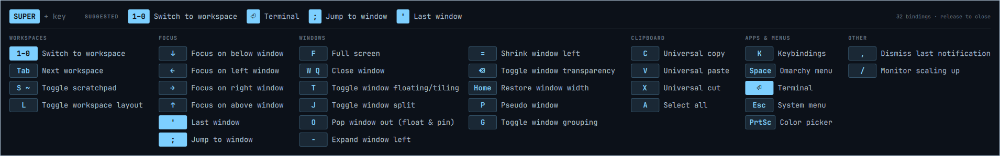

# Keybindings hint for Omarchy

Hold `SUPER` and a bar slides up along the bottom of the screen listing what
every `SUPER + key` binding does, like [which-key](https://github.com/folke/which-key.nvim)
in Neovim. Let go of `SUPER` and it fades away.



- **Suggests your next key:** a Suggested row in the header shows up to four
  keys you're likely to want right now, based on what's on screen. The same
  keys are highlighted in their groups.
- **Learns your habits (optional):** turn on learning mode and it also
  suggests what you usually do next, based on what you just did.
- **Grouped:** bindings are sorted into columns (Workspaces, Focus, Windows,
  Clipboard, Apps & menus, Other). Groups longer than six entries wrap into a
  second column so the bar stays short.
- **Keycaps:** keys are drawn as keycaps and show as they read on the keyboard
  (`'`, `;`, `⌫`, `←`, …). The ten workspace keys fold into one `1–0` entry.
- **Always your bindings:** the list is read from
  `omarchy menu keybindings --print`, so your own bindings and their
  descriptions show up too.
- **Never in the way:** the bar doesn't take the keyboard. Press a key while it
  shows and that binding runs as normal.
- **Fits the screen:** each column is as wide as its text. On narrower screens
  the text shrinks to fit rather than being cut off.
- **Themed:** colors and font come from the current Omarchy theme.
- **On/off switch:** turn the hint off when you don't want it. The setting is
  remembered across restarts.

## Suggestions

When the bar opens it looks at the focused window and the current workspace,
and suggests keys in this order (up to four):

| On screen | Suggested |
|---|---|
| Empty workspace | Terminal, Omarchy menu, Switch to workspace, Keybindings |
| Window is full screen | Full screen (to leave it) |
| Window is in a group | Toggle window grouping |
| Window is floating | Pop window out (to tile it back) |
| 3 or more windows | Jump to window, Last window, Toggle window split |
| 2 windows | Last window, Toggle window split, Full screen |
| 1 window | Full screen, Terminal, Close window |
| Any windows | Next workspace, if there's room left |

Suggestions are matched by binding description, not by key, so they follow
you if you rebind something. Bindings you don't have are skipped.

## Learning mode

Off by default. When it's on, the plugin notices what you do, such as
switching workspace, going full screen, opening a terminal or closing a window.
It counts what you tend to do next. Once a "next move" has happened at least
twice, it takes up to two of the four Suggested spots, ahead of the screen
rules.

```sh
omarchy-shell shell summon nejcc.keybindings-hint '{"learning":"on"}'
omarchy-shell shell summon nejcc.keybindings-hint '{"learning":"off"}'
omarchy-shell shell summon nejcc.keybindings-hint '{"learning":"toggle"}'
omarchy-shell shell summon nejcc.keybindings-hint '{"learning":"reset"}'   # forget everything learned
```

It starts with a few **starter habits**, written by hand rather than recorded,
so it's useful from the first minute. For example, after opening a terminal
it suggests another terminal, full screen, or switching workspace. Each starter
habit counts as seen twice, so anything you really do three or more times
outranks it.

Hyprland never reports which key was pressed, so learning works from its
events and guesses which binding caused each one:

| Hyprland event | Counted as |
|---|---|
| Workspace changed | Switch to workspace |
| Full screen changed | Full screen |
| Window closed | Close window |
| Terminal window opened (foot, kitty, Alacritty, Ghostty) | Terminal |
| Special workspace shown | Toggle scratchpad |
| Group toggled | Toggle window grouping |
| Floating changed | the first binding with "float" in its description |

Focus changes aren't counted, because a mouse click looks the same as a key.

What it learns is kept locally in
`~/.local/state/nejcc.keybindings-hint.learned.json` (or under
`$XDG_STATE_HOME`) and never leaves your machine. The file holds only binding
descriptions and counts.

## Requirements

Omarchy with its Quickshell-based shell, on Hyprland with Lua config. It calls
`hyprctl`, `notify-send` and `omarchy menu keybindings --print`, which all ship
with Omarchy. Nothing else to install.

## Install

```sh
omarchy plugin add https://github.com/Nejcc/omarchy-kebindings-hint.git --enable
```

Then add to `~/.config/hypr/bindings.lua`:

```lua
-- Keybindings hint: hold SUPER to show the bar, release SUPER to hide it.
hl.bind("SUPER_L", hl.dsp.exec_cmd("omarchy-shell shell summon nejcc.keybindings-hint"), { long_press = true, ignore_mods = true })
hl.bind("SUPER + SUPER_L", hl.dsp.exec_cmd("omarchy-shell shell hide nejcc.keybindings-hint"), { release = true })
hl.bind("SUPER_L", hl.dsp.exec_cmd("omarchy-shell shell hide nejcc.keybindings-hint"), { release = true })

-- Turn the hint on or off.
o.bind("SUPER + SHIFT + K", "Toggle keybindings hint", "omarchy-shell shell summon nejcc.keybindings-hint '{\"enabled\":\"toggle\"}'")

-- Turn learning mode on or off.
o.bind("SUPER + CTRL + SHIFT + K", "Toggle keybindings hint learning", "omarchy-shell shell summon nejcc.keybindings-hint '{\"learning\":\"toggle\"}'")
```

The long-press binding has to be on bare `SUPER_L` with `ignore_mods = true`.
Bound as `SUPER + SUPER_L` it never fires, because `SUPER` doesn't count as
held yet at the moment the key goes down.

`SUPER + SHIFT + K` and `SUPER + CTRL + SHIFT + K` are free in the default
Omarchy bindings, next to Omarchy's own `SUPER + K` keybindings menu. Pick
other keys if you prefer.

## Usage

| Shortcut | Does |
|---|---|
| hold `SUPER` | Show the bar; release to hide it |
| `SUPER + SHIFT + K` | Turn the hint on or off (a notification says which) |
| `SUPER + CTRL + SHIFT + K` | Turn learning mode on or off (a notification says which) |

### Commands

```sh
# Show or hide the bar with any key you like instead of holding SUPER
omarchy-shell shell toggle nejcc.keybindings-hint

# Turn the hint on, off, or flip it
omarchy-shell shell summon nejcc.keybindings-hint '{"enabled":"on"}'
omarchy-shell shell summon nejcc.keybindings-hint '{"enabled":"off"}'
omarchy-shell shell summon nejcc.keybindings-hint '{"enabled":"toggle"}'
```

While the hint is off, a marker file exists at
`~/.local/state/nejcc.keybindings-hint.disabled` (or under `$XDG_STATE_HOME`).
Deleting it and restarting the shell turns the hint back on.

## Uninstall

```sh
omarchy plugin remove nejcc.keybindings-hint
```

Then delete the lines you added to `~/.config/hypr/bindings.lua`, and remove
the settings files if you like:

```sh
rm -f ~/.local/state/nejcc.keybindings-hint.learned.json ~/.local/state/nejcc.keybindings-hint.disabled
```

## Tests

```sh
node --test tests/     # unit tests for the logic, no dependencies (also run in CI)
tests/smoke.sh         # live test against your running Omarchy shell
```

The unit tests cover parsing, grouping, suggestions and learning, including
corrupt or hostile settings files. The smoke test opens and closes the bar,
flips every setting, checks the 6-second auto-hide and hammers it with quick
open/close cycles. It backs up your settings files first and puts them back
afterwards. Expect a few on/off notifications while it runs.

## Limitations

- Only plain `SUPER + key` bindings are listed, not `SUPER + SHIFT + key` and
  other combinations.
- Learning mode guesses from events. A workspace switch by mouse, or a window
  closed by the app itself, counts the same as the key would.
- Groups are guessed from words in each description, because Omarchy's list
  has no categories. Anything unmatched lands in Other.
- If a release is missed, the bar hides itself after 6 seconds.
- On screens narrower than about 1900 logical pixels the text shrinks to fit,
  down to 9px. Below about 1250px the last column can still be cut off.
- After editing the plugin files, run `omarchy restart shell`. The shell's
  automatic reload doesn't always pick up changes.

## License

MIT
